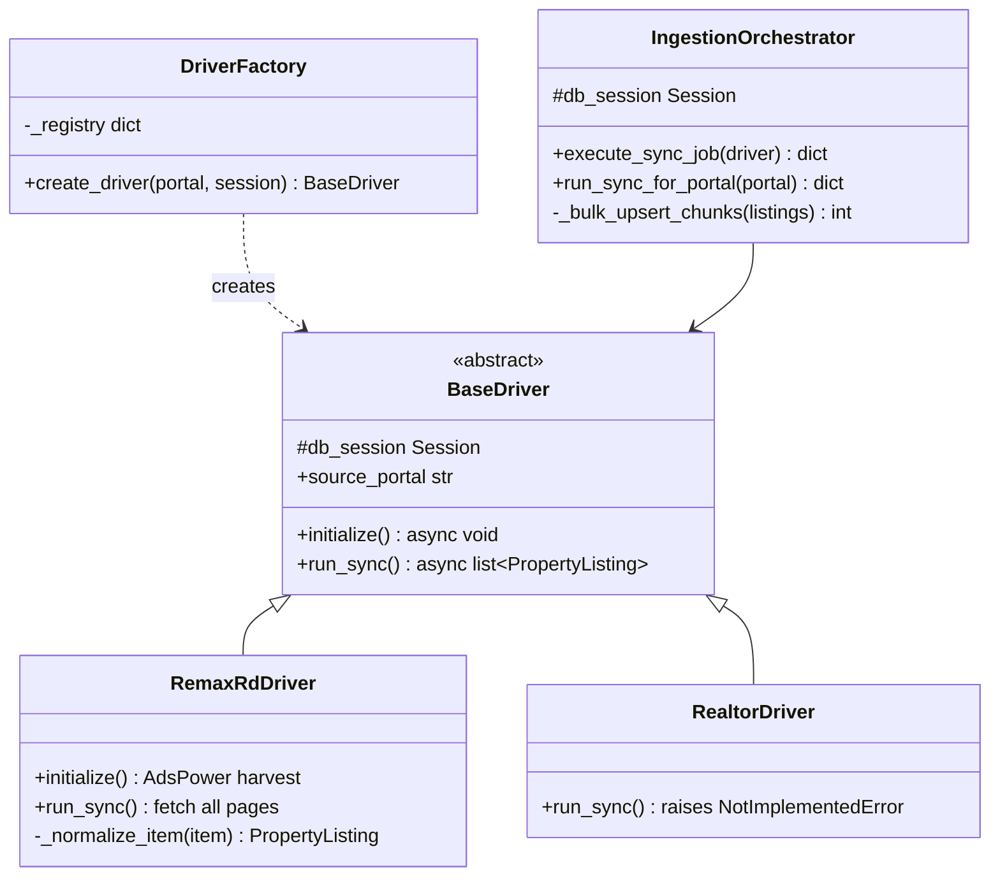

# Spec: Ingestion OOP Architecture — FastAPI Data Acquisition

## Status: SHIPPED (V2 full crawl requires Manual Success / AdsPower)
**Roadmap:** STREAM 2 PHASE 4.1  
**Branch:** `develop`  
**Feature README:** `docs/features/STREAM-2-PHASE-4.1-ingestion-oop/`
**App:** `apps/api-fastapi/`  
**Replaces:** Procedural `run_portal_sync` + `RemaxRDScraper` + inline `get_scraper_driver()`

---

## 1. Objective

Encapsulate portal ingestion into stateful OOP classes so new listing portals plug in via `BaseDriver` + `DriverFactory` without copying orchestration, persistence, or HTTP wiring.

**In scope**
- `IngestionOrchestrator`, `BaseDriver`, `DriverFactory`, `RemaxRdDriver`, `RealtorDriver` stub
- `POST /api/v1/properties/trigger-crawl` wired through factory + orchestrator
- CLI `crawl_test.py` uses same stack

**Out of scope (PHASE 4.2+)**
- Realtor.com parser
- Job status / metrics API
- Schema changes to `real_estate.properties`

---

## 2. Domain Model — `PropertyListing`

Ground truth: `models.py`. Drivers **must** normalize API payloads to these fields (not ad-hoc DTO names).

| Field | Type | Required | Notes |
|-------|------|----------|-------|
| `id` | `str` (BLU) | auto | `generate_blu_id()` |
| `remote_id` | `str` | yes | Portal listing id (RE/MAX `item.id`) |
| `source_portal` | `str` | yes | e.g. `remaxrd`, `realtor` |
| `url` | `str` | yes | Canonical property URL |
| `title` | `str` | yes | Display title |
| `price_usd` | `float` | yes | USD amount |
| `price_dop` | `float \| null` | no | Filled when currency is DOP |
| `province` | `str` | yes | City / province label |
| `sector` | `str` | yes | Neighborhood; indexed |
| `bedrooms` | `int` | yes | |
| `bathrooms` | `float` | yes | full + 0.5 × half |
| `square_meters` | `float` | yes | construction or land sqm |
| `raw_description` | `str` | yes | Summary line for contracts/search |
| `is_active` | `bool` | yes | RE/MAX: `status.lower() == "disponible"` |
| `tenant_id` | `str` | auto | default `tenant_all_blue` |
| `last_modified` | `int` | auto | ms timestamp on upsert |
| `deleted_at` | `datetime \| null` | auto | soft-delete primitive |

**Unique business key:** `(source_portal, remote_id)` — orchestrator dedupes on this pair.

---

## 3. Class Architecture



### 3.1 `BaseDriver` — `scrapers/drivers/base_driver.py`

```python
class BaseDriver(ABC):
    source_portal: str

    def __init__(self, db_session: Session) -> None: ...

    @abstractmethod
    async def initialize(self) -> None: ...

    @abstractmethod
    async def run_sync(self) -> list[PropertyListing]: ...
```

**Rules**
- Drivers **read** session only if needed for existence checks; **writes** belong to `IngestionOrchestrator`.
- `run_sync()` returns in-memory `PropertyListing` instances ready for upsert (all required scalar fields set).

### 3.2 `DriverFactory` — `scrapers/driver_factory.py`

```python
class DriverFactory:
    _registry: dict[str, Type[BaseDriver]] = {
        "remaxrd": RemaxRdDriver,
        "realtor": RealtorDriver,
    }

    def create_driver(self, source_portal: str, db_session: Session) -> BaseDriver: ...
```

| Portal key | Class | Runtime status |
|------------|-------|----------------|
| `remaxrd` | `RemaxRdDriver` | Production |
| `realtor` | `RealtorDriver` | Stub → API **501** |

- Missing key → `ValueError("Unsupported source_portal '…'. Supported portals: …")` → HTTP **400**.

### 3.3 `IngestionOrchestrator` — `services/sync_service.py`

```python
class IngestionOrchestrator:
    BULK_CHUNK_SIZE = 500  # or 250 per legacy; pick one and keep stable

    def __init__(self, db_session: Session) -> None: ...

    def execute_sync_job(self, driver: BaseDriver) -> dict[str, Any]: ...
    # Returns: { source_portal, fetched, inserted, updated, elapsed_seconds }

    @classmethod
    def run_sync_for_portal(cls, source_portal: str) -> dict[str, Any]: ...
    # Opens Session(engine) — mandatory for BackgroundTasks

    def _bulk_upsert_chunks(self, listings: list[PropertyListing]) -> dict[str, int]: ...
```

**Job pipeline**
1. `await driver.initialize()`
2. `listings = await driver.run_sync()`
3. Chunked upsert: insert new `(source_portal, remote_id)`; update existing rows (`last_modified`, `server_version++`)
4. Log `fetched`, `inserted`, `updated`, `elapsed_seconds`

**Background session rule:** `trigger-crawl` MUST NOT pass `Depends(get_db)` session into `BackgroundTasks`. Schedule `IngestionOrchestrator.run_sync_for_portal(portal_key)` only.

---

## 4. `RemaxRdDriver` — `scrapers/drivers/remaxrd.py`

### 4.1 Constants (non-regression)

| Constant | Value |
|----------|-------|
| API base | `https://api.remaxrd.com/v2/realestates` |
| Query | `?city=1&page={n}` (page 1 discovers `meta.last_page`) |
| Web URL base | `https://www.remaxrd.com/en/propiedad/{slug}` |
| Impersonate | `chrome120` (`curl_cffi`) |
| Concurrency | `20` (semaphore) |
| 429 backoff | `min(2 ** attempt, 30)` seconds |
| Max retries | `4` per page (legacy) or `5` (acceptable if documented) |
| DOP→USD | `59.50` |

### 4.2 `initialize()`

- Call `RemaxCredentialHarvester.harvest()` (AdsPower profile `ADSPOWER_PROFILE_ID`, default `k1d0yw3d`).
- Store `HarvestedCredentials`; expose as `credentials.as_curl_headers()` for API requests.

### 4.3 `run_sync()`

1. Ensure credentials (call `initialize()` if missing).
2. Fetch page 1 → read `meta.last_page`.
3. `asyncio.gather` pages `2..last_page` under semaphore.
4. For each `data[]` item: `_normalize_item` → append unique by `remote_id`.
5. Return `list[PropertyListing]` (no DB I/O).

### 4.4 Normalization contract (`_normalize_item`)

Maps RE/MAX JSON `item` → `PropertyListing` fields:

```python
# Pseudocode — must match develop RemaxRDScraper.normalize_item
remote_id = str(item["id"])
slug = item.get("slug") or remote_id
url = f"{REMAX_WEB_BASE}/{slug}"

currency_iso = (item.get("currency") or {}).get("iso", "USD").upper()
price_usd, price_dop = resolve_prices(item, currency_iso)  # DOP_TO_USD_RATE = 59.50

province = title_case(item.get("city") or "Santo Domingo")
sector = title_case(item.get("sector") or "Unknown")
bedrooms = safe_int(item.get("bedrooms"), 0)
bathrooms = safe_float(baths) + 0.5 * safe_float(half_baths)
square_meters = max(sqm_construction, sqm_land logic from develop)

title = f"{realstate_type} en {sector}"  # append business_type when present
raw_description = f"{realstate_type} | {business_type} | {sector}, {city} | ..."
is_active = str(item.get("status") or "").lower() == "disponible"
source_portal = "remaxrd"
```

---

## 5. `RealtorDriver` — `scrapers/drivers/realtor.py`

```python
class RealtorDriver(BaseDriver):
    source_portal = "realtor"

    async def initialize(self) -> None:
        return None

    async def run_sync(self) -> list[PropertyListing]:
        raise NotImplementedError("Driver 'realtor' pending parser construction")
```

Router MUST return **501** before scheduling background work (do not rely on background `NotImplementedError` for client contract).

---

## 6. HTTP API

Router: `routers/properties.py`  
Prefix: `/api/v1/properties`

### `POST /trigger-crawl?source_portal={key}`

| Input | Status | Body |
|-------|--------|------|
| `remaxrd` | **202** | `{ "message": "Sync job initialized successfully" }` |
| `realtor` | **501** | `{ "detail": "Driver 'realtor' pending parser construction" }` |
| unknown | **400** | Factory `ValueError` as `detail` |

Handler flow:

```python
factory = DriverFactory()
driver = factory.create_driver(source_portal, db)  # validates portal
if isinstance(driver, RealtorDriver):
    raise HTTPException(501, ...)
background_tasks.add_task(IngestionOrchestrator.run_sync_for_portal, portal_key.lower())
return JSONResponse(202, {"message": "Sync job initialized successfully"})
```

### `GET /?page=&page_size=&source_portal=&sector=`

Paginated `PropertyListing` rows; filter `deleted_at IS NULL` when soft-delete is enforced in list queries.

---

## 7. File Layout

```
apps/api-fastapi/
├── main.py                         # include properties + contracts routers
├── routers/properties.py
├── services/sync_service.py        # IngestionOrchestrator
├── scrapers/
│   ├── driver_factory.py
│   ├── credential_harvester.py     # RemaxCredentialHarvester (unchanged)
│   ├── adspower_client.py
│   └── drivers/
│       ├── base_driver.py
│       ├── remaxrd.py              # RemaxRdDriver
│       └── realtor.py
└── crawl_test.py                   # run_portal_sync(portal)
```

**Deprecated — do not extend**
- `scrapers/base.py` (`BaseScraperDriver`)
- `scrapers/drivers/__init__.py` `get_scraper_driver()`
- `main.sync.py`, `main.full.py` (milestone snapshots only)

---

## 8. Portal Onboarding Checklist (PHASE 4.2+)

1. Add `scrapers/drivers/<portal>.py` subclassing `BaseDriver`.
2. Register in `DriverFactory._registry`.
3. Implement `initialize()` + `run_sync()` → `list[PropertyListing]` per §2.
4. Add row to §3.2 table and verification scenario below.
5. Update this spec.

---

## 9. Verification Gates

| # | Scenario | Expected |
|---|----------|----------|
| V1 | Import smoke | `from routers.properties import router` succeeds in venv |
| V2 | `python crawl_test.py --portal remaxrd` | Completes; `fetched` ≈ 2600+; inserts/updates ≥ 0 |
| V3 | `POST trigger-crawl?source_portal=remaxrd` | **202**; background logs complete |
| V4 | `POST … source_portal=realtor` | **501**; no background job |
| V5 | `POST … source_portal=foo` | **400** with supported portal list |
| V6 | DB integrity | No duplicate rows for same `(source_portal, remote_id)` |
| V7 | Regression | `price_usd`, `sector`, `url` populated on new inserts |

**Manual Success** required before git commit.

---

## 10. Implementation Drift Watchlist

When aligning code to this spec, fix any of the following if present:

| Drift | Spec correction |
|-------|-----------------|
| Fields `external_id`, `listing_type`, `price`, `currency`, `raw_payload` | Use §2 `PropertyListing` columns |
| Pagination `meta.pagination.total_pages` | Use `meta.last_page` |
| Upsert `ON CONFLICT` only on wrong columns | Use `(source_portal, remote_id)` insert + update pattern from develop |
| `harvest_remaxrd_credentials` one-off | Use `RemaxCredentialHarvester` class |

---

## 11. Related Artifacts

- Feature tasks: `docs/features/STREAM-2-PHASE-4.1-ingestion-oop/task.md` (optional checklist)
- Follow-on spec (future): `ingestion-realtor.spec.md` — STREAM 2 PHASE 4.2