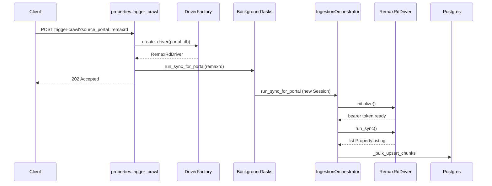

# STREAM 2 PHASE 4.1 — Ingestion OOP Refactor

## Plan → Review → Task → Execute → Walkthrough

| Field | Value |
|-------|--------|
| **Feature** | Stateful OOP ingestion & multi-portal driver registry |
| **Spec** | [.spec-kit/specs/api/ingestion-oop.spec.md](../../../.spec-kit/specs/api/ingestion-oop.spec.md) |
| **Integration branch** | `develop` |
| **Feature branch** | `feat/ingestion-oop-refactor` |
| **Apps touched** | `apps/api-fastapi/` |

---

## Problem

Milestones 1–3.1 delivered a working RE/MAX pipeline via procedural functions (`run_portal_sync`, `RemaxRDScraper.sync_from_api`, inline upsert in the driver). Adding Realtor and additional portals would duplicate:

- Background job + metrics logging
- Postgres chunk upsert / conflict handling
- HTTP error mapping per portal

## Solution

Introduce three cohesive layers:

1. **Drivers** — portal-specific fetch + normalize (`BaseDriver`)
2. **Factory** — token → class registry (`DriverFactory`)
3. **Orchestrator** — persistence + job lifecycle (`IngestionOrchestrator`)

---

## Architecture (runtime)



---

## Implementation phases

### Phase A — Core abstractions (PR 1)

| # | Deliverable | Files |
|---|-------------|-------|
| A.1 | `BaseDriver` ABC | `scrapers/drivers/base_driver.py` |
| A.2 | `DriverFactory` + registry | `scrapers/driver_factory.py` |
| A.3 | `IngestionOrchestrator` | `services/sync_service.py` |
| A.4 | Export surface | `scrapers/drivers/__init__.py`, `services/__init__.py` |

**Exit criteria:** Imports resolve; no behavior change yet if wired.

### Phase B — Driver migration (PR 2)

| # | Deliverable | Files |
|---|-------------|-------|
| B.1 | `RemaxRdDriver` — harvest, 429 backoff, mapping | `scrapers/drivers/remaxrd.py` |
| B.2 | `RealtorDriver` stub | `scrapers/drivers/realtor.py` |
| B.3 | Remove upsert from driver (orchestrator only) | `remaxrd.py` |

**Exit criteria:** `crawl_test.py --portal remaxrd` matches prior row counts (~2.6k+).

### Phase C — API wiring (PR 3)

| # | Deliverable | Files |
|---|-------------|-------|
| C.1 | `routers/properties.py` — list + trigger-crawl | new router |
| C.2 | Slim `main.py` — include routers | `main.py` |
| C.3 | Background uses `run_sync_for_portal` | `routers/properties.py` |

**Exit criteria:** 202 / 501 / 400 responses per spec table.

### Phase D — Cleanup & docs (PR 4, optional same branch)

| # | Deliverable |
|---|-------------|
| D.1 | Mark `scrapers/base.py` deprecated in comment |
| D.2 | This feature folder + spec-kit |
| D.3 | `walkthrough.md` after Manual Success |

---

## Branching & commits (suggested)

```text
develop
  └── feat/ingestion-oop-refactor
        ├── commit: feat(api): add BaseDriver, DriverFactory, IngestionOrchestrator
        ├── commit: feat(api): migrate RemaxRdDriver and Realtor stub
        ├── commit: feat(api): properties router and trigger-crawl OOP path
        └── commit: docs: STREAM 2 PHASE 4.1 spec and feature plan
```

Merge: `--no-ff` into `develop` after verification. Tag optional: `v0.2.0-ingestion-oop`.

---

## Risks & mitigations

| Risk | Mitigation |
|------|------------|
| Request-scoped DB in background task | `run_sync_for_portal` opens dedicated session |
| Token / 429 regression | Preserve exact backoff + impersonate constants in spec |
| Duplicate listings | Keep `ON CONFLICT DO NOTHING` in orchestrator only |
| AdsPower timeout | Unchanged `adspower_client` 120s timeout |

---

## Acceptance criteria (feature complete)

- [ ] All Phase A–C files present and match spec-kit layout
- [ ] `POST trigger-crawl` returns 202 for `remaxrd` without blocking response
- [ ] `realtor` returns 501 before background scheduling
- [ ] Invalid portal returns 400 with supported list
- [ ] Full remaxrd sync produces no duplicate `(source_portal, external_id)`
- [ ] User **Manual Success** recorded in `walkthrough.md`
- [ ] Merged to `develop` with chunked commits

---

## Out of scope

- Storefront changes
- Realtor parser (STREAM 2 PHASE 4.2)
- Docker service for API (compose is Postgres-only today)